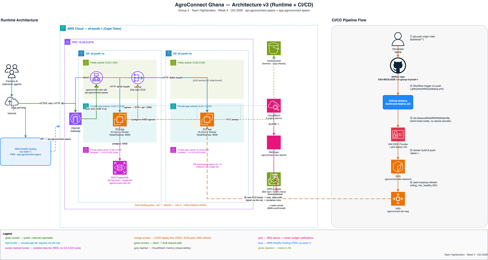

# AgroConnect Ghana — Group 3 (Highlanders)

**Course:** ICS 534 Cloud Computing | **Milestone:** PROSIT 1  
**Target Region:** AWS `af-south-1` (Cape Town) & `eu-west-1` (Amplify)  
**Live Frontend:** [`https://app.agroconnect.space`](https://app.agroconnect.space) | **API Endpoint:** [`https://api.agroconnect.space`](https://api.agroconnect.space)

AgroConnect Ghana is an offline-first agricultural profiling and registration platform designed for field extension agents operating in rural communities across Ghana where cellular connectivity is intermittent or unavailable.

---

## Documentation Hub (`docs/`)

Comprehensive system documentation is maintained inside the [`docs/`](./docs) folder:

| Document | Description |
|---|---|
| [**Documentation Index**](./docs/README.md) | Navigation index, directory mapping, and high-level project summary |
| [**1. System Overview**](./docs/system-overview.md) | Operational context, high-level topology & Well-Architected Framework alignment |
| [**2. Architecture Decisions (ADRs)**](./docs/architecture-decisions.md) | Formal records: ADR-001 through ADR-016 |
| [**2b. Engineering Learnings**](./docs/learnings.md) | Engineering journal — discoveries & mental models (Amplify API gaps, CloudFront routing) |
| [**2c. AI Tools Disclosure**](./docs/ai-tools-usage.md) | Academic integrity disclosure per Ashesi AI policy: tool categories, prompts & verification |
| [**3. Empirical Research & Benchmarks**](./docs/empirical-research.md) | Network latency testing from Ghana & cloud provider comparison matrix |
| [**4. Client Tier (PWA)**](./docs/client-tier.md) | Offline-first architecture, Dexie IndexedDB, sync queue & hardware hooks |
| [**5. API Tier**](./docs/api-tier.md) | Node.js/Express TypeScript `agroconnect-api`: every PWA contract, Postgres, SMS, payments, health probes |
| [**6. Data Tier**](./docs/data-tier.md) | PostgreSQL schema & migrations (`backend/migrations/`), audit trigger, S3 media |
| [**7. Cloud Infrastructure**](./docs/cloud-infrastructure.md) | Terraform modular IaC (11 modules), `af-south-1` VPC, `fck-nat`, ALB TLS & ASG |
| [**8. CI/CD & Operations**](./docs/ci-cd-and-operations.md) | GitHub Actions OIDC deployment, ASG rolling refresh & team IAM governance |

---

## Architecture Overview

The system is architected as an offline-first client syncing with a highly available, dual-AZ cloud runtime on AWS, automated via GitOps CI/CD.



```
┌─────────────────────────────────────────────────────────────────────────┐
│                       Client Tier (Offline-First PWA)                   │
│   React 19 • Vite • Dexie (IndexedDB) • Client UUIDs • GPS • Camera     │
│   Hosted on AWS Amplify (eu-west-1 origin + global CloudFront edges)    │
│   Domain: https://app.agroconnect.space                                 │
└────────────────────────────────────┬────────────────────────────────────┘
                                     │ HTTPS :443 (api.agroconnect.space)
                                     ▼
┌─────────────────────────────────────────────────────────────────────────┐
│                    AWS Cloud — af-south-1 (Cape Town)                   │
│                                                                         │
│   [Public Subnets (10.20.1.0/24, 10.20.2.0/24)]                         │
│     ├── Internet Gateway (IGW)                                          │
│     ├── Application Load Balancer (ALB) — ACM TLS Termination           │
│     └── fck-nat (t4g.nano) — Cost-optimized outbound NAT gateway       │
│                                                                         │
│   [Private App Subnets (10.20.11.0/24, 10.20.12.0/24)]                 │
│     └── Auto Scaling Group (min 1, des 1, max 3)                       │
│           ├── Target-Tracking on ALBRequestCountPerTarget (500 req/min) │
│           └── EC2 (t3.micro) + Docker running Express :8000 (Node/TS)   │
│                                                                         │
│   [Private Data Subnets (10.20.21.0/24, 10.20.22.0/24)]                 │
│     └── PostgreSQL / Amazon RDS (Isolated — no default internet route)  │
└────────────────────────────────────▲────────────────────────────────────┘
                                     │
┌────────────────────────────────────┴────────────────────────────────────┐
│                    CI/CD & GitOps Automation (GitHub)                   │
│   PR: Smoke Test + Terraform Validate                                   │
│   Push to main: AWS IAM OIDC Auth ➔ ECR Push ➔ ASG Instance Refresh     │
│   Frontend push to main: AWS Amplify Git-connected CI/CD (amplify.yml)  │
└─────────────────────────────────────────────────────────────────────────┘
```

---

## Regional Strategy & Empirical Benchmarks

The deployment region was selected through empirical network latency testing conducted from Ghana:

| Cloud Provider | Region | Location | Median TCP (ms) | Median Request RTT (ms) | Notes |
|---|---|---|---|---|---|
| **AWS** | **`af-south-1`** | **Cape Town** | **133 ms** | **74 ms** | **Selected primary region (lowest RTT)** |
| AWS | `eu-south-2` | Spain | 120 ms | 112 ms | Low TCP handshake, higher RTT |
| AWS | `eu-west-2` | London | 125 ms | 117 ms | European alternative (+43 ms RTT) |
| AWS | `us-east-1` | N. Virginia | 255 ms | 175 ms | High round-trip penalty |
| Azure | `southafricanorth` | Johannesburg | 103 ms | 129 ms | Higher app RTT than AWS af-south-1 |
| GCP | `europe-west9` | Paris | 118 ms | 127 ms | Good European performance |

*Full analysis & dataset:* See [`docs/empirical-research.md`](./docs/empirical-research.md) and [`labs/Cloud Platform Regions Latency Investigation.xlsx`](/Users/josetseph/Library/CloudStorage/GoogleDrive-joseph.etse@ashesi.edu.gh/My%20Drive/CC%20Group%203%20Highlanders/Prosits/1/labs/Cloud%20Platform%20Regions%20Latency%20Investigation.xlsx).

---

## System Subsystems & Directory Structure

Each tier is decoupled and maintained in its respective subdirectory:

```
.
├── docs/                   # Detailed system documentation dossier
├── frontend/               # Offline-first Progressive Web App (PWA)
├── backend/                # Node.js/TypeScript API for every PWA contract (Postgres, S3, SMS, payments)
├── db/                     # Relational schema & migration scripts
├── infra/                  # Modular Terraform IaC (af-south-1 & eu-west-1)
├── scripts/                # Administrative & IAM onboarding scripts
├── .github/                # Workflows (CI/CD) and CODEOWNERS
├── amplify.yml             # Monorepo build spec for AWS Amplify Hosting
└── CONTRIBUTING.md         # GitOps branch & contribution guidelines
```

### 1. Client Tier — Offline-First PWA ([`frontend/`](./frontend))
* **Live Deployment:** [`https://app.agroconnect.space`](https://app.agroconnect.space) (AWS Amplify Hosting, `eu-west-1` origin with global CloudFront edge delivery).
* **Stack:** React 19, TypeScript, Vite, Dexie (IndexedDB), Custom Service Worker (`injectManifest`).
* **Primary Principle:** *The app never waits for the network.*
* **Local Storage:** Utilizes browser **IndexedDB** wrapped with **Dexie** across three isolated tables (`drafts`, `farmers`, `photos`). Unsaved forms autosave every 300 ms.
* **Client-Side UUIDs:** Every profile generates an immutable client UUID (`clientId`) upon initiation, allowing idempotent retries against the backend without duplicate record creation.
* **Background Sync & Concurrency (ADR-012):** Custom Service Worker (`src/sw.ts`) registers the `agroconnect-sync` tag with the W3C Background Sync API to drain queued farmer records when cellular signal returns even after the app is closed. Concurrency across the UI tab and background Service Worker is guaranteed via the W3C Web Locks API (`navigator.locks.request('agroconnect-sync')`), safely recovering stranded records on every run.
* **Core Capabilities:**
  * **Produce Marketplace:** Real-time commodity market prices, produce browsing, and harvest listing with Ghana Cedi (`₵`) pricing.
  * **Mobile Money Wallet:** Integrated wallet with MoMo transaction simulation and active polling.
  * **Agronomic Weather & Advisory:** Open-Meteo weather forecasts and contextual farming advisories.
  * **Crop Health Checks:** Field inspection logging with pest and plot condition recording.
* **Hardware Resilience:**
  * In-browser photo compression reducing camera captures to `<100 KB` via HTML Canvas before queueing.
  * Direct satellite GPS polling (independent of cellular network coverage).
* **Localization (ADR-010):** Full 424-string human translations for **Twi (`tw.json`)** and **Ewe (`ee.json`)** with CI placeholder validation; custom font subsets for Ghanaian orthography (`Ɛɛ`, `Ɔɔ`, `Ŋŋ`, `Đɖ`, `Ƒƒ`, `Ɣɣ`, `Ʋʋ`, `Ʒʒ`).
* *Details & specifications:* See [`docs/client-tier.md`](./docs/client-tier.md) and [`frontend/README.md`](./frontend/README.md).

### 2. Application & API Tier ([`backend/`](./backend))
* **Service:** `agroconnect-api` in **Node.js 24**, **Express 5** and **TypeScript** ([ADR-011](./docs/architecture-decisions.md#adr-011-backend-runtime-migration-to-nodejs-and-typescript), [ADR-013](./docs/architecture-decisions.md#adr-013-one-backend-service-for-every-contract-on-postgres)). One service implements all six PWA contracts: farmer registration and photos, sign-in for all four roles (SMS codes via Arkesel, RS256 tokens), the admin dashboard and audit log, payments (votex365 checkout in test mode), crop checks and produce listings.
* **Data:** Postgres 16 on RDS, migrated on boot; idempotency through `client_id` unique constraints; an audit trigger records every change with the acting user.
* **Containerization:** Multi-stage Alpine Docker ([`backend/Dockerfile`](./backend/Dockerfile)) running unprivileged as `USER node` on port `8000`; secrets are read at runtime by ARN, never baked into user data.
* **Tests:** the mock server's contract tests run against the real API on Postgres (108 tests, PGlite and Postgres 16 in CI).
* *Details & run instructions:* See [`docs/api-tier.md`](./docs/api-tier.md) and [`backend/README.md`](./backend/README.md).

### 3. Database Tier ([`db/`](./db))
* **Engine:** PostgreSQL 16 on Amazon RDS, migrated by the API on boot ([`db/README.md`](./db/README.md)).
* **Schema ([`backend/migrations/001_initial.sql`](./backend/migrations/001_initial.sql)):** accounts for all four roles, farmer records with crops, payments, loan requests, crop checks, listings and feedback. Every offline-created row has `client_id UUID NOT NULL UNIQUE`; an audit trigger records who changed what, without PIN or password hashes.
* *Details:* See [`docs/data-tier.md`](./docs/data-tier.md).

### 4. Cloud Infrastructure as Code ([`infra/`](./infra))
* **Orchestration:** HashiCorp Terraform (`>= 1.10`) structured into 11 modular components under [`infra/modules/`](./infra/modules):
  * `network` — VPC, 6 subnets across 2 AZs, IGW, routing tables.
  * `nat` — ARM64 `fck-nat` (`t4g.nano`) cutting NAT costs by >90%.
  * `alb` — Application Load Balancer, ACM TLS certificate for `api.agroconnect.space`, HTTP-to-HTTPS redirect.
  * `compute` — EC2 IAM role, launch template, ASG, `awslogs` Docker logging driver, target-tracking scaling policy.
  * `ecr` — Container registry (`agroconnect-dev-backend`).
  * `database` — Amazon RDS PostgreSQL 16 on `db.t4g.micro` in isolated subnets with KMS encryption.
  * `storage` — S3 media bucket (`agroconnect-dev-media`) with versioning, AES256, and multipart lifecycle rules.
  * `secrets` — AWS Secrets Manager container for Arkesel SMS API credentials (`agroconnect-dev-arkesel-sms`).
  * `observability` — SNS alerts topic, CloudWatch operational dashboard, alarms for ALB/ASG/RDS/EC2, and a $100 monthly budget.
  * `cicd` — AWS IAM OIDC federation for GitHub Actions.
  * `frontend` — AWS Amplify App in `eu-west-1` with custom domain `app.agroconnect.space`.
* **Remote State:** Centralized in Amazon S3 (`af-south-1`) with Terraform 1.10+ native state locking (`use_lockfile = true`), completely eliminating external DynamoDB dependencies.
* **Load Balancing & TLS:** AWS ALB with automatic HTTP :80 to HTTPS :443 redirection and ACM DNS-validated certificate for `api.agroconnect.space`.
* **Dynamic Scaling:** Target-tracking policy on `ALBRequestCountPerTarget` (500 req/min/target, scaling 1→3) to absorb bursty registration traffic.
* **Zero-SSH Administration:** Instances boot with AWS Systems Manager Core policy (`AmazonSSMManagedInstanceCore`) using IMDSv2; port 22 is completely closed.
* *Details & deployment commands:* See [`docs/cloud-infrastructure.md`](./docs/cloud-infrastructure.md) and [`infra/README.md`](./infra/README.md).

### 5. GitOps CI/CD & Deployments ([`.github/workflows/`](./.github/workflows), [`amplify.yml`](./amplify.yml))
* **Continuous Integration ([`ci.yml`](./.github/workflows/ci.yml)):**
  * Gated on pull requests into `main`.
  * Executes Node.js dependency resolution, TypeScript compilation (`npm run build`), server boot `/health` probe verification, and Terraform validation across all 11 modules (`fmt -check`, `validate`).
* **Backend Continuous Deployment ([`deploy.yml`](./.github/workflows/deploy.yml)):**
  * Triggered exclusively on merges to `main`.
  * Authenticates to AWS via **IAM OIDC Web Identity Federation** (no long-lived credentials stored in GitHub).
  * Builds and pushes versioned + `:latest` Docker images to Amazon ECR (`agroconnect-dev-backend`).
  * Triggers an automated rolling instance refresh (launch-before-terminate: `MinHealthyPercentage: 100%`, `MaxHealthyPercentage: 200%`) with concurrency retry handling (`InstanceRefreshInProgress`) waiting for in-flight launch template refreshes before starting.
* **Frontend Continuous Deployment ([`amplify.yml`](./amplify.yml)):**
  * AWS Amplify Hosting pipeline building the React PWA on push to `main` with automatic edge invalidation.
* *Details:* See [`docs/ci-cd-and-operations.md`](./docs/ci-cd-and-operations.md).

### 6. Operations & Team Governance ([`scripts/`](./scripts), [`CONTRIBUTING.md`](./CONTRIBUTING.md))
* **IAM Onboarding Script ([`scripts/create_team_iam.sh`](./scripts/create_team_iam.sh)):** Automated provisioning of team members with `PowerUserAccess`, strict `ForceMFA` policy enforcement, and mandatory first-login password resets.
* **Contribution Flow:** Documented in [`CONTRIBUTING.md`](./CONTRIBUTING.md). Direct commits to `main` are restricted; code ownership is enforced via [`.github/CODEOWNERS`](./.github/CODEOWNERS).

---

## AWS Well-Architected Framework Alignment

| Pillar | Architectural Implementation in AgroConnect |
|---|---|
| **Operational Excellence** | Infrastructure 100% codified across 11 Terraform modules (`infra/modules/`) with native S3 state locking. Immutable container deployments through ECR and ASG rolling refreshes with concurrency retry protection. Docker `awslogs` container log streaming to CloudWatch Logs. Unified CloudWatch operational dashboard (`agroconnect-dev-overview`) and automated SNS email alarm dispatches. |
| **Security** | Multi-tier security groups (`ALB -> App -> Data`). Private subnets with zero public IPs for app and database tiers. No open SSH ports (SSM Session Manager only). GitHub Actions authenticates via short-lived OIDC tokens. Database credentials and third-party SMS tokens secured in AWS Secrets Manager. IAM team members protected by mandatory MFA. Auto-managed TLS certificates on ALB and Amplify via ACM. |
| **Reliability** | ALB and app instances across `af-south-1a` and `af-south-1b` (RDS single-AZ for the lab). Application Load Balancer health checks with automatic ASG replacement. Target-tracking scaling on `ALBRequestCountPerTarget` (500 req/min/target). Global CloudFront edge asset delivery for the PWA. Zero-touch client outbox drainage via W3C Background Sync and Web Locks preventing duplicate submissions. Automated RDS snapshots and S3 bucket versioning. |
| **Performance Efficiency** | Region selected via empirical latency testing (`af-south-1` @ ~74 ms median RTT). Burstable EC2 `t3.micro` instances accommodating registration bursts. Static PWA cached at CloudFront edge; client-side IndexedDB caching and photo compression reducing payload overhead by >95%. |
| **Cost Optimization** | Usage of `fck-nat` (`t4g.nano`) reducing NAT egress costs by ~90%. Right-sized compute with free-tier `t3.micro` credits. ASG configured with min 1 / max 3 capacity. Static hosting on AWS Amplify. \$100/month AWS Budgets guardrail with a 50% forecast warning and a 100% actual spend alert to SNS. |
| **Sustainability** | Elimination of redundant network transfers via offline-first batch syncing. Dynamic instance scaling during off-peak hours. Adoption of ARM64 Graviton instances for NAT (`t4g.nano`) and RDS (`db.t4g.micro`), reducing power consumption and emissions. |

*Full architectural deep-dive:* See [`docs/system-overview.md`](./docs/system-overview.md).

---

## Team

| Name | Role | GitHub Handle | Responsibility Area |
|---|---|---|---|
| **Joseph Etse** | Project Manager | [@josetseph](https://github.com/josetseph) | Overall Project Architecture & Coordination |
| **Eugene Sewor** | Cloud / DevOps Lead | [@eugene-sew](https://github.com/eugene-sew) | Terraform IaC, AWS af-south-1, CI/CD GitOps |
| **Elise Kennedy-Angbo** | Data Lead | [@Elise-Oyi](https://github.com/Elise-Oyi) | Backend Service, Database Schema & Migrations |
| **Perfect Avugla** | Frontend Lead | [@PeaElorm](https://github.com/PeaElorm) | Offline-First PWA, Mobile UI & Synchronization |
