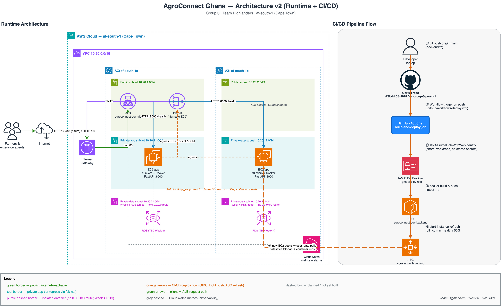

# AgroConnect Ghana — Documentation Hub

Welcome to the comprehensive system documentation for **AgroConnect Ghana**, developed by **Group 3 (Highlanders)** for **ICS 534 Cloud Computing (PROSIT 1)** at Ashesi University.

This documentation dossier covers the entire system lifecycle—from empirical cloud research and architectural decision records (ADRs) to individual subsystem implementations, infrastructure code, offline client synchronization, and CI/CD operations.

---

## Documentation Navigation

```
docs/
├── README.md                     # Documentation Index & Hub (this page)
├── system-overview.md            # High-level architecture, business context & Well-Architected alignment
├── architecture-decisions.md     # Architectural Decision Records (ADR-001 through ADR-011)
├── learnings.md                  # Engineering journal — discoveries & corrections for reflection
├── empirical-research.md         # Network latency benchmarks & cloud provider comparison
├── client-tier.md                # Offline-first PWA, IndexedDB (Dexie), sync queue & hardware resilience
├── api-tier.md                   # Containerized Node.js/Express TypeScript API & contracts
├── data-tier.md                  # Relational schema (PostgreSQL), data models & S3 media offloading
├── cloud-infrastructure.md       # Terraform AWS af-south-1 IaC, VPC topology, fck-nat & ALB TLS
├── ci-cd-and-operations.md       # GitOps CI/CD (OIDC), ASG rolling refresh & team IAM governance
└── assets/                       # Architecture diagrams & application UI screenshots
    ├── architecture-v2.png       # Complete runtime & CI/CD architecture diagram
    ├── architecture-v2.drawio    # Editable draw.io source for architecture-v2.png
    ├── architecture-simple.png   # Foundation MVP architecture diagram
    ├── pwa-offline-screen.jpeg   # Mobile UI in offline field mode
    └── pwa-online-screen.jpeg    # Mobile UI in online synchronization mode
```

---

## Quick Reference Links

| Document | Focus Area | Key Highlights |
|---|---|---|
| [**1. System Overview**](./system-overview.md) | Architectural Vision | Context in Ghana rural agriculture, high-level topology, Well-Architected Framework 6-pillar analysis |
| [**2. Architecture Decisions (ADRs)**](./architecture-decisions.md) | Formal Decisions | ADR-001 through ADR-011 (Amplify hosting, language scope, Node.js runtime) |
| [**2b. Engineering Learnings**](./learnings.md) | Reflection Journal | Discoveries during implementation (API gaps, routing-layer mental models). Material for lab reflection + viva. |
| [**3. Empirical Research**](./empirical-research.md) | Cloud Benchmarks | Network latency testing from Ghana (AWS vs Azure vs GCP) & provider service comparison |
| [**4. Client Tier (PWA)**](./client-tier.md) | Frontend & Edge | Offline-first design, Dexie IndexedDB, client UUIDs, GPS polling, photo compression, Twi/Ewe translations |
| [**5. API Tier**](./api-tier.md) | Application Backend | Node.js 24 / Express 5 TypeScript API, unprivileged Docker, health probes, client UUIDs |
| [**6. Data Tier**](./data-tier.md) | Persistence Layer | PostgreSQL schema (`db/schema.sql`), cascading relationships, S3 object pointers |
| [**7. Cloud Infrastructure**](./cloud-infrastructure.md) | AWS & Terraform | Dual-AZ VPC in `af-south-1`, ARM64 `fck-nat` cost optimization, ALB HTTPS, ASG, SSM |
| [**8. CI/CD & Operations**](./ci-cd-and-operations.md) | Automation & Security | GitHub Actions OIDC deployment, Node 24 smoke tests, ASG instance refresh, IAM team onboarding |

---

## High-Level Topology Snapshot



```
┌─────────────────────────────────────────────────────────────┐
│                 PWA Client (Offline-First)                  │
│  React 19 • Vite • Dexie • Client UUIDs • GPS • Compression │
│  Hosted on AWS Amplify (eu-west-1 / Global CloudFront Edge) │
│  Live URL: https://app.agroconnect.space                    │
└──────────────────────────────┬──────────────────────────────┘
                               │ HTTPS (api.agroconnect.space)
                               ▼
┌─────────────────────────────────────────────────────────────┐
│                 AWS af-south-1 (Cape Town)                  │
│  [Public Subnets]   ALB (ACM TLS) + fck-nat (t4g.nano)      │
│  [Private App]      ASG (min 1, des 1, max 3; req-count)    │
│                     EC2 (t3.micro) running Express :8000    │
│  [Private Data]     Isolated Subnets (Week 4 RDS Ready)     │
└──────────────────────────────▲──────────────────────────────┘
                               │
┌──────────────────────────────┴──────────────────────────────┐
│                   GitOps CI/CD Deployment                   │
│   PR: Smoke Test + Terraform Validate                       │
│   Push main (backend): GitHub Actions (OIDC) → ECR → ASG    │
│   Push main (frontend): AWS Amplify Git-Connected Deploy    │
└─────────────────────────────────────────────────────────────┘
```

---

## Team & Responsibilities

| Name | Role | GitHub Handle | Core Scope |
|---|---|---|---|
| **Joseph Etse** | Project Manager | [@josetseph](https://github.com/josetseph) | Overall architecture, technical coordination, repository maintenance |
| **Eugene Sewor** | Cloud / DevOps Lead | [@eugene-sew](https://github.com/eugene-sew) | Terraform IaC, AWS networking, CI/CD pipelines, security |
| **Elise Kennedy-Angbo** | Data Lead | [@Elise-Oyi](https://github.com/Elise-Oyi) | Backend API development, database modeling, schema migrations |
| **Perfect Avugla** | Frontend Lead | [@PeaElorm](https://github.com/PeaElorm) | Progressive Web App, offline persistence, sync engine, field UI |
