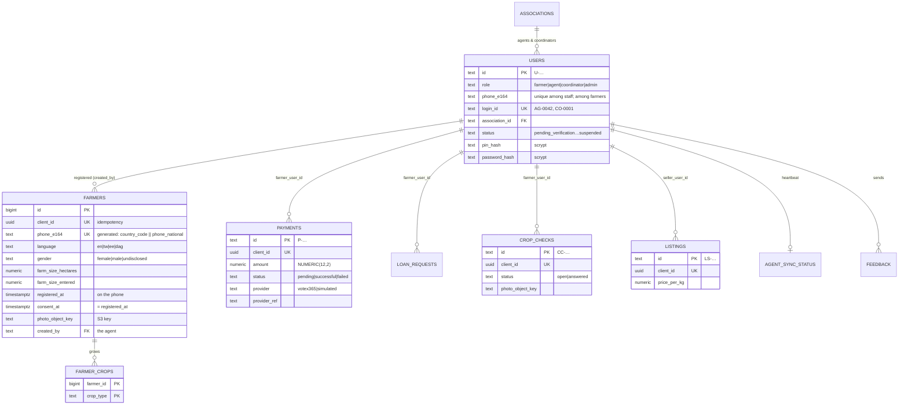

# Data Tier — Relational Schema & Persistence Architecture

**Lead:** Elise Kennedy-Angbo ([@Elise-Oyi](https://github.com/Elise-Oyi))  
**Engine:** PostgreSQL 16 on Amazon RDS (`db.t4g.micro`, single-AZ for the lab)  
**Schema:** [`backend/migrations/001_initial.sql`](../backend/migrations/001_initial.sql), applied on boot ([`db/README.md`](../db/README.md))  
**Design:** [`DATA-CONTRACT.md`](../DATA-CONTRACT.md) and the contracts in [`frontend/agroconnect-pwa/docs/`](../frontend/agroconnect-pwa/docs)  
**Associated Architectural Records:** [ADR-004 (Subnet Segmentation)](./architecture-decisions.md#adr-004-three-tier-subnet-segmentation-with-cost-optimized-nat), [ADR-002 (Client-Generated Identity)](./architecture-decisions.md#adr-002-offline-first-client-architecture-with-client-generated-identity)

---

## 1. Overview

```
┌────────────────────────────────────────────────────────────────────────┐
│                  App Tier (EC2, private app subnets)                   │
│                    10.20.11.0/24 & 10.20.12.0/24                       │
└───────────────┬────────────────────────────────────┬───────────────────┘
                │ SQL over verified TLS (5432)        │ HTTPS (instance role)
                ▼                                     ▼
┌─────────────────────────────────────┐   ┌──────────────────────────────┐
│ RDS PostgreSQL 16                   │   │ S3 media bucket (private)    │
│ isolated data subnets               │   │ farmers/<id>/photo.jpg       │
│ 10.20.21.0/24, 10.20.22.0/24        │   │ crop-checks/<id>/photo.jpg   │
│ rows hold object keys, never images │   └──────────────────────────────┘
└─────────────────────────────────────┘
```

* **Provisioning ([`infra/modules/database`](../infra/modules/database)):** PostgreSQL 16 on `db.t4g.micro`, `gp3` storage with autoscaling, encrypted at rest, automated backups, and a **managed master secret** in Secrets Manager that RDS rotates. Single-AZ, with no final snapshot and no deletion protection: lab settings to flip before real data (see the module comments).
* **Media ([`infra/modules/storage`](../infra/modules/storage)):** a private, versioned S3 bucket with SSE-S3 and a lifecycle rule for incomplete uploads. Photos go through the API, never straight from a phone.
* **Schema changes** are SQL migrations in `backend/migrations/`, applied by each instance on boot under a Postgres advisory lock, so a rolling deploy migrates exactly once.

---

## 2. Entity-Relationship Model

`users` holds every login account (all four roles). A farmer's login account and the record an agent made for them are linked by `phone_e164`, deliberately without a foreign key: a farmer may sign in before any agent registers them.



Also: `otp_codes` (hashed sign-in codes and send times for the rate limit), `loan_requests`, `feedback`, `agent_sync_status` (one row per agent, overwritten), `audit_log`, and `schema_migrations`.

---

## 3. Integrity and Idempotency

1. **Every offline-created row carries `client_id UUID NOT NULL UNIQUE`.** The API inserts and catches SQLSTATE `23505`: on the `…_client_id_key` constraint it answers **200** with the existing row (a phone retrying), on `farmers_phone_e164_key` it answers **409** (a different farmer with the same number). It never searches first, so two simultaneous sends cannot both insert.
2. **Phones are E.164 by construction.** `phone_e164` is a generated column (`country_code || phone_national`) with a UNIQUE constraint, and a CHECK rejects a national number with a leading 0, so `0241234567` and `+233 24 123 4567` collide correctly.
3. **Allowed values are CHECK constraints** (language, gender, crops, statuses, currencies, amounts > 0). A violation (`23514`) becomes a 400, never a 500.
4. **Farm size** is stored in hectares (`acres × 0.404686`) alongside the entered number and its unit, so a conversion mistake is recoverable.
5. **Money** is `NUMERIC(12,2)`, never a float.

---

## 4. Audit Trail

`audit_row()` runs after every insert, update and delete on `users`, `farmers`, `farmer_crops`, `payments`, `loan_requests`, `crop_checks` and `listings`, and writes:

| Column | Holds |
|---|---|
| `event` | What the admin screen shows: `agent.approve`, `coordinator.suspend`, `farmers.insert`, … |
| `detail` | For an update, the changed columns as `column: old → new` |
| `old_data`, `new_data` | The full rows as JSONB, **minus `pin_hash` and `password_hash`** |
| `app_actor`, `actor_role` | The signed-in user from the token, set per transaction with `set_config('app.actor', $1, true)` |
| `changed_by`, `changed_at` | The database user and time |

Login bookkeeping (`failed_attempts`, `locked_until`) does not produce rows, so the log is not flooded by sign-ins; a PIN or password change shows only as "PIN changed". CSV exports are recorded as `table_name = 'app'` events.

---

## 5. Network Isolation

* **CIDRs:** `10.20.21.0/24` (`af-south-1a`) and `10.20.22.0/24` (`af-south-1b`).
* **No public routes:** the data route table has no `0.0.0.0/0` route, neither Internet Gateway nor NAT.
* **Security group:** port 5432 only from the app security group. No workstation can reach the database directly; schema changes arrive through the app's migrations.

---

## 6. Encryption, Credentials and Backups

* **At rest:** RDS storage encryption (AWS-managed key) and SSE-S3 on the bucket.
* **In transit:** RDS requires TLS; the app verifies the server certificate against the af-south-1 RDS CA bundle baked into its image (`DB_CA_FILE`).
* **Credentials:** the master password lives only in the RDS-managed secret. The app reads it with its instance role for each new connection, so a rotation needs no restart and no password is ever written to user data, environment variables or the repository.
* **Backups:** automated daily snapshots with point-in-time recovery inside the retention window.
