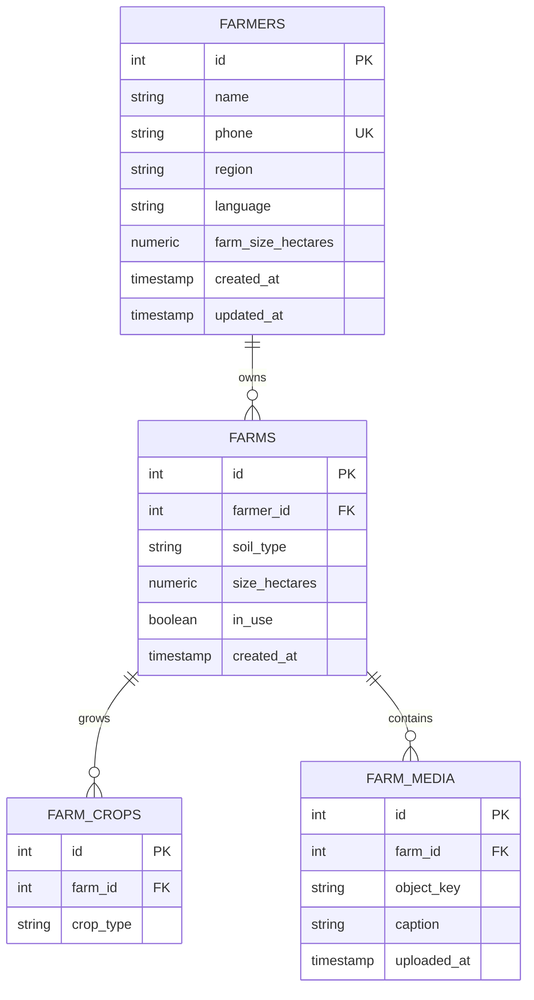

# Data Tier — Relational Schema & Persistence Architecture

**Lead:** Elise Kennedy-Angbo ([@Elise-Oyi](https://github.com/Elise-Oyi))  
**Target Engine:** PostgreSQL 16 on Amazon RDS (Dual-AZ)  
**Schema Definition:** [`db/schema.sql`](../db/schema.sql)  
**Associated Architectural Records:** [ADR-004 (Subnet Segmentation)](./architecture-decisions.md#adr-004-three-tier-subnet-segmentation-with-cost-optimized-nat), [ADR-002 (Client-Generated Identity)](./architecture-decisions.md#adr-002-offline-first-client-architecture-with-client-generated-identity)

---

## 1. Overview & Evolution Roadmap

The AgroConnect data tier provides durable, strongly consistent persistence for farmer profiles, parcel boundaries, crop allocations, and verification media across Ghana.

```
┌────────────────────────────────────────────────────────────────────────┐
│                        App Tier (EC2 Private App)                      │
│                        10.20.11.0/24 & 10.20.12.0/24                   │
└───────────────────────────────────┬────────────────────────────────────┘
                                    │ SQL Queries (Port 5432 / TLS)
                                    ▼
┌────────────────────────────────────────────────────────────────────────┐
│             Isolated Data Subnets (10.20.21.0/24, 10.20.22.0/24)       │
│                                                                        │
│   ┌──────────────────────────────────────────────────────────────┐     │
│   │ Amazon RDS PostgreSQL (Multi-AZ)                             │     │
│   │                                                              │     │
│   │   [farmers] ──<1:N>── [farms] ──<1:N>── [farm_crops]         │     │
│   │                           │                                  │     │
│   │                         <1:N>                                │     │
│   │                           ▼                                  │     │
│   │                     [farm_media]                             │     │
│   │                          │ (Stores object keys only)         │     │
│   └──────────────────────────┼───────────────────────────────────┘     │
└──────────────────────────────┼─────────────────────────────────────────┘
                               │ S3 Object References (HTTPS)
                               ▼
┌────────────────────────────────────────────────────────────────────────┐
│             Amazon S3 Bucket (Compressed Photos & Documents)           │
│             af-south-1 (Targeted Object Storage Offload)               │
└────────────────────────────────────────────────────────────────────────┘
```

### Architectural Progression
* **Week 3 MVP:** A thread-safe, in-memory dictionary store in FastAPI to validate infrastructure, networking, and CI/CD pipelines without incurring idle database licensing charges.
* **Week 4 Production Target:** Managed **PostgreSQL 16 on Amazon RDS**, deployed across dedicated dual-AZ isolated subnets.
* **Media Decoupling:** Binary media (photos) are offloaded to **Amazon S3**, keeping relational rows lean and queries high-speed.

---

## 2. Entity-Relationship Data Model

The relational model is normalized to Third Normal Form (3NF) to guarantee referential integrity and eliminate update anomalies:



---

## 3. Relational Schema Breakdown

The SQL definition is maintained at [`db/schema.sql`](../db/schema.sql):

### 1. `farmers` (Core Identity)
Represents a uniquely identified smallholder farmer.
* **`id SERIAL PRIMARY KEY`:** Internal relational surrogate key.
* **`phone TEXT UNIQUE NOT NULL`:** Business key enforcing the rule that a single farmer can only be registered once in the system.
* **`name TEXT NOT NULL`:** Full legal name of the farmer.
* **`region TEXT`:** Administrative Ghanaian region (e.g., Northern, Savannah, Ashanti).
* **`language TEXT`:** Preferred dialect code (`en`, `tw`, `ee`, `dag`).
* **`farm_size_hectares NUMERIC`:** Aggregate reported land holdings.
* **`created_at / updated_at TIMESTAMP DEFAULT now()`:** Audit trail timestamps.

### 2. `farms` (Parcel Land Plots)
A farmer may own or cultivate multiple separate agricultural parcels.
* **`id SERIAL PRIMARY KEY`:** Plot identifier.
* **`farmer_id INTEGER NOT NULL REFERENCES farmers(id) ON DELETE CASCADE`:** Foreign key linking to the registered farmer. If a farmer profile is purged, related plots cascade automatically.
* **`soil_type TEXT`:** Agricultural classification (e.g., loamy, sandy, clay).
* **`size_hectares NUMERIC`:** Area of this specific plot.
* **`in_use BOOLEAN DEFAULT true`:** Active cultivation flag.

### 3. `farm_crops` (Crop Allocations)
A normalized table allowing many-to-one crop varieties per farm plot.
* **`farm_id INTEGER NOT NULL REFERENCES farmers(id) ON DELETE CASCADE`:** Links to the parent farm plot.
* **`crop_type TEXT NOT NULL`:** Crop selection (e.g., maize, tomato, cassava, cocoa, yam).

### 4. `farm_media` (Binary Asset Offloading)
Maintains metadata pointers for images and documents stored in Amazon S3.
* **`object_key TEXT NOT NULL`:** S3 key path (e.g., `farms/42/plot-satellite-01.jpg`).
* **`caption TEXT`:** Human-readable context or field notes.
* **`uploaded_at TIMESTAMP DEFAULT now()`:** Upload completion timestamp.

> [!IMPORTANT]
> Raw image BLOBs are never stored directly within PostgreSQL. This preserves database buffer pool memory, reduces backup sizes by 90%, and accelerates table scan operations.

---

## 4. Subnet Isolation & Network Security

The data tier resides in dedicated private subnets provisioned via Terraform:
* **CIDRs:** `10.20.21.0/24` (`af-south-1a`) and `10.20.22.0/24` (`af-south-1b`).
* **Zero Public Routes:** The data tier route table contains **no default gateway** (`0.0.0.0/0` route). It has neither Internet Gateway access nor NAT Gateway access.
* **Security Group Ingress:** Restricted exclusively to PostgreSQL port `5432` originating from the Application Security Group (`app-sg`):
  $$\text{App Security Group} \xrightarrow{\text{Port 5432 (PostgreSQL)}} \text{Data Security Group}$$
* Direct database queries from workstations or public endpoints are blocked at the AWS network hypervisor layer.

---

## 5. Data Integrity & Idempotency Rules

1. **Unique Phone Constraint:** Mobile extension agents operate concurrently. If two agents attempt to register the same farmer simultaneously, the database raises a unique key violation on `phone`, causing the API to return `HTTP 409 Conflict`.
2. **Client UUID Reconciliation:** The mobile PWA assigns each record a client UUID (`clientId`). The backend verifies this key to ensure network retries do not trigger duplicate insertions.
3. **Cascading Referential Integrity:** All child tables (`farms`, `farm_crops`, `farm_media`) enforce `ON DELETE CASCADE`, ensuring no orphaned records persist if a parent entity is deleted.

---

## 6. Backup, Recovery & Encryption Standards

* **Encryption at Rest:** Amazon RDS instances use AWS KMS managed keys to encrypt underlying EBS gp3 storage volumes.
* **Encryption in Transit:** Connections to PostgreSQL mandate TLS 1.3/1.2 (`sslmode=require`).
* **Automated Snapshots:** 7-day retention period for automated daily snapshots with Point-In-Time Recovery (PITR) to any second within the retention window.
* **Credential Protection:** Master database credentials are generated programmatically and stored in **AWS Secrets Manager**, preventing plaintext secrets in repository code.

